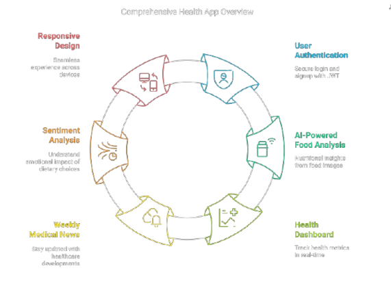

# 🏥 Intel MediLink

[](https://intel-medi-link.vercel.app)

[](https://www.kaggle.com/code/jaisanthk/intel-project-hospital)

> Advanced healthcare insights powered by AI - analyze food, track health metrics, get personalized recommendations

[Live Demo](https://intel-medi-link.vercel.app)

## 📺 Watch Our Tutorial Video

<p align="center">
  <a href="https://www.youtube.com/watch?v=Z3O4yR2Lus0" target="_blank">
    
  </a>
</p>

<p align="center">
  <b>👆 Click the image above to watch our detailed tutorial and demonstration</b>
</p>

> **See it in action!** Get a complete walkthrough of all features, including the weekly news section and how to use the application effectively.

## 🚀 Quick Start

### Option 1: Use the Deployed Version (Recommended)

The application is fully deployed and ready to use:

- **Frontend**: Available at [https://intel-medi-link.vercel.app](https://intel-medi-link.vercel.app)
- **Node.js Backend**: Already running on Render
- **Python ML Backend**: Running on Kaggle

Simply visit the [live demo](https://intel-medi-link.vercel.app) to use the application without any setup!

### Option 2: Run Frontend Locally (with deployed node backends)

```bash
# Clone the repository
git clone https://github.com/jaisanth123/Intel_MediLink.git

# Navigate to frontend directory
cd Intel_MediLink/frontend

# Install dependencies
npm install

# Start development server
npm run dev
```

---

### ML Backend (Python with FastAPI) - Kaggle Only

> ⚠️ **Important**: The Python backend must be run on Kaggle for optimal performance, not locally.

To access or run the Python ML backend:

1. Visit the [Kaggle notebook](https://www.kaggle.com/code/jaisanthk/intel-project-hospital)
2. Set up your Hugging Face token in Kaggle secrets as "hf_token"

To obtain your Hugging Face token, visit [Hugging Face Token Settings](https://huggingface.co/settings/tokens).

#### Access the Model

To access the model, use the following link: [Bio-Medical-MultiModal-Llama-3-8B-V1](https://huggingface.co/ContactDoctor/Bio-Medical-MultiModal-Llama-3-8B-V1).

Set up the Hugging Face token in your Kaggle secrets:

- Secret name: `hf_token`
- Secret value: Your Hugging Face API token

---

3. If you want to run the notebook cells

```python
# ONLY RUN THIS ON KAGGLE - DO NOT RUN LOCALLY
# 1. Set up Hugging Face token in Kaggle secrets as "hf_token"
import os
from kaggle_secrets import UserSecretsClient
user_secrets = UserSecretsClient()
hf_token = user_secrets.get_secret("hf_token")
print(hf_token)

# 2. Login to Hugging Face
from kaggle_secrets import UserSecretsClient
from huggingface_hub import login

user_secrets = UserSecretsClient()
HF_TOKEN = user_secrets.get_secret("hf_token")

# Log in to Hugging Face
login(token=HF_TOKEN)
print("Successfully logged into Hugging Face!")
# 3. Clone the repository
!git clone https://github.com/jaisanth123/Intel_MediLink.git
# 4. Navigate to Python backend

%cd Intel_MediLink/backend/python

# 5. Install dependencies
!pip install uvicorn fastapi ngrok python-multipart torchvision ngrok transformers huggingface_hub pyttsx3 vaderSentiment openai-whisper

# 6. Start the server
!uvicorn app:app --port 8000
```

---

## 🌟 Key Features

- **User Authentication** - Secure login and signup with JWT
- **AI-Powered Food Analysis** - Get nutritional insights from food images. Users can upload a photo of the ingredients, provide their age, gender, and a description. This feature utilizes the fine-tuned **Bio-Medical-Llama-3-8B** model from Hugging Face for accurate analysis.

---

- **Health Insights Chatbot** - Engage in conversations about medical reports and health-related queries. Users can chat normally with this chatbot to gain insights and advice based on their medical data.

---

- **Sentiment Analysis** - Understand the emotional impact of dietary choices. Users can provide audio files, text input, or voice input for analysis, allowing for a comprehensive understanding of their sentiments regarding food and health.

---

- **Health Dashboard** - Track your health metrics in real-time.
- **Weekly Medical News** - Stay updated with the latest healthcare developments.
- **Responsive Design** - Seamless experience across all devices, including mobile, ensuring accessibility and usability for all users.

---

## 🏗️ Architecture

The project is built with a three-tier architecture:

1. **Frontend**: React.js with Vite and Tailwind CSS (deployed on Vercel)
2. **Node.js Backend**: Express.js server with MongoDB (deployed on Render)
3. **Python ML Backend**: FastAPI with Hugging Face models (running on Kaggle)

<p align="center">
  
</p>

---

## 📋 Documentation

Only needed if you're setting up your own deployment:

#### Node.js Backend

```
MONGODB_URI=your_mongodb_connection_string
JWT_SECRET=your_jwt_secret for examole "jwt_secret"
PORT=5000
```

#### Python Backend (Kaggle)

> ⚠️ **Important**: The Python backend must be run on Kaggle for optimal performance, not locally.

To access or run the Python ML backend:

1. Visit the [Kaggle notebook](https://www.kaggle.com/code/jaisanthk/intel-project-hospital)
2. Set up your Hugging Face token in Kaggle secrets as "hf_token"

To obtain your Hugging Face token, visit [Hugging Face Token Settings](https://huggingface.co/settings/tokens).

#### Access the Model

To access the model, use the following link: [Bio-Medical-MultiModal-Llama-3-8B-V1](https://huggingface.co/ContactDoctor/Bio-Medical-MultiModal-Llama-3-8B-V1).

Set up the Hugging Face token in your Kaggle secrets:

- Secret name: `hf_token`
- Secret value: Your Hugging Face API token


---

## 🔄 Deployment Status

- **Frontend**: Deployed on [Vercel](https://intel-medi-link.vercel.app)
- **Node.js Backend**: Deployed on Render
- **Python ML Backend**: Running on [Kaggle](https://www.kaggle.com/code/jaisanthk/intel-project-hospital)

> **Note**: The weekly news feature uses a free API that only works on localhost. For deployed versions, this feature is demonstrated in our [video tutorial](https://www.youtube.com/watch?v=Z3O4yR2Lus0).

---

## 📞 Contact

- 📱 Phone: +91 9944403749
- 📧 Email: [jaisanth2006@gmail.com](mailto:jaisanth2006@gmail.com)
- 💻 GitHub: [@jaisanth123](https://github.com/jaisanth123)
- 🔗 Project Link: [Intel_MediLink](https://github.com/jaisanth123/Intel_MediLink)

---

<p align="center">
  Made with ❤️ by the Intel MediLink team
</p>
